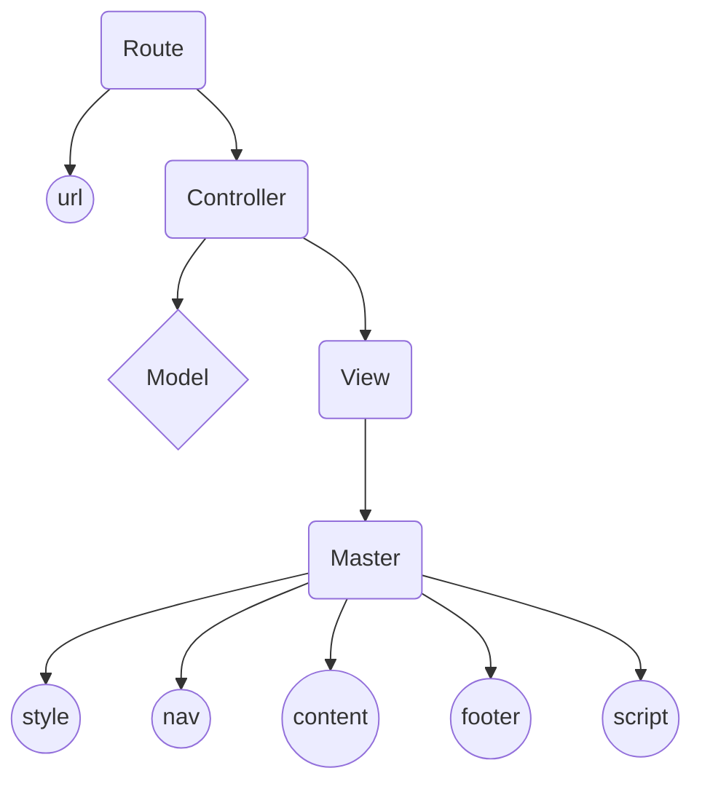

# Welcome to Kint-js Framework
Hi! Let's create a web application with the MVC concept using this minimalist framework.
## Installation
```bash
npm install kint-js
```
## Kint builder
Add this command into scripts object inside the **package.json** file
```json
"scripts": {
  "kint": "node node_modules/kint-js/kint"
}
```
And then run the added command
```bash
npm run kint
```
### Basic
Start the app
```bash
node kint start
```
Reset the app
```bash
node kint reset
```
### Add routes
Add new route and then re-arrange routes order automatically
```bash
node kint [method] [url]
```
### Create
Creating model, view, and controller file easily using kint builder
#### model
```bash
node kint create model [model-name]
```
#### view
```bash
node kint create view [view-name]
```
#### controller
```bash
node kint create controller [controller-name]
```
#### model + view + controller
```bash
node kint create mvc [mvc-name@method]
```
### rollback
Rolling back create action
```bash
node kint rollback
```
## Main file
```javascript
const [ port, status ] = [ 4120, 'App started!' ]
const { app, Kint } = require('kint-js')

/*
* use kint object if needed
* kint class has some method that may usefull for you
* some of them are .pkg(), .logLeft(), .logRight()

* Do not remove start and end comment

*/

/* start */
/* define routes here (between start and end comments) */
/* end */

app.start(port, status)
```
## Controller file
Just export a function that receive three parameter
```javascript
/* -={name}=- controller */
module.exports = (req, res, Model) => {
	/*
	* model used : -={modelName}=-
	* code...
	*/
	res.view('-={name}=-', { title : '-={name}=-' })
}
```
## Model file
Here we just need to define the type of data should be stored in this model
```javascript
/* -={name}=- Schema */
const -={name}=-Schema = {
	id : Number, /* This field should be exists */
	/* other fields */
}

module.exports = -={name}=-Schema
```
## View files
Before we can render the targeted view, we must have a master view.
### master file
```html
<!DOCTYPE html>
<html lang="en">
<head>
	<meta charset="UTF-8">
	<meta name="viewport" content="width=device-width, initial-scale=1.0">
	<link rel="stylesheet" href="/assets/css/style.css">
	<title>-={ data.title }=-</title>
</head>
<body>
	<!-- 
		-=( path, data )=- 	// including tag
		-={ data }=-		// printing tag
		-=[ script ]=-		// scripting tag
	-->
	-=(content, data)=-
	<script src="/assets/js/script.js"></script>
</body>
</html>
```

# KINTARO XD &copy; Kint-js
